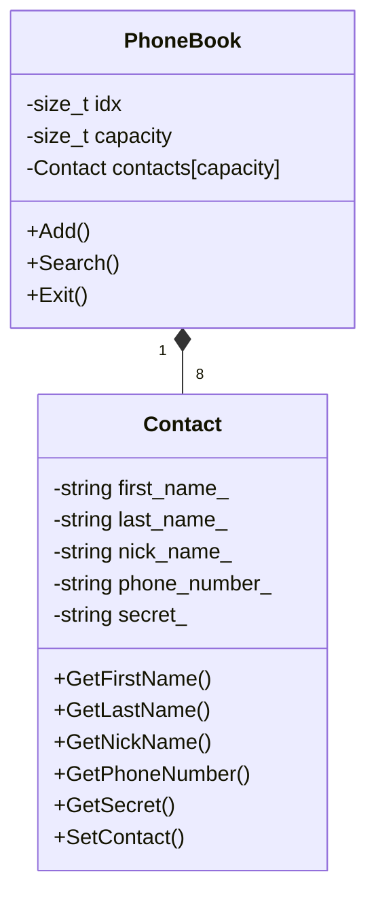

```mermaid
classDiagram

PHONEBOOK "1" *-- "8" CONTACT

class PHONEBOOK["PhoneBook"] {
    -size_t     idx
    -size_t     capacity
    -Contact    contacts[capacity]

    +Add()
    +Search()
    +Exit()
}

class CONTACT["Contact"] {
    -string     first_name_
    -string     last_name_
    -string     nick_name_
    -string     phone_number_
    -string     secret_

    +GetFirstName()
    +GetLastName()
    +GetNickName()
    +GetPhoneNumber()
    +GetSecret()
    +SetContact()
}
```
