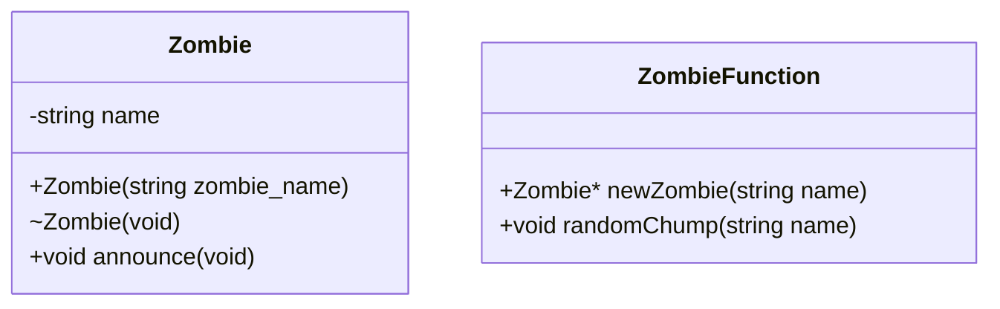

```mermaid
classDiagram

class ZOMBIE["Zombie"] {
    -string name

    +Zombie(string zombie_name)
    ~Zombie(void)
    +void       announce(void)
}

class ZOMBIE_FUNCTION["ZombieFunction"] {
    +Zombie*    newZombie(string name)
    +void       randomChump(string name)
}
```
