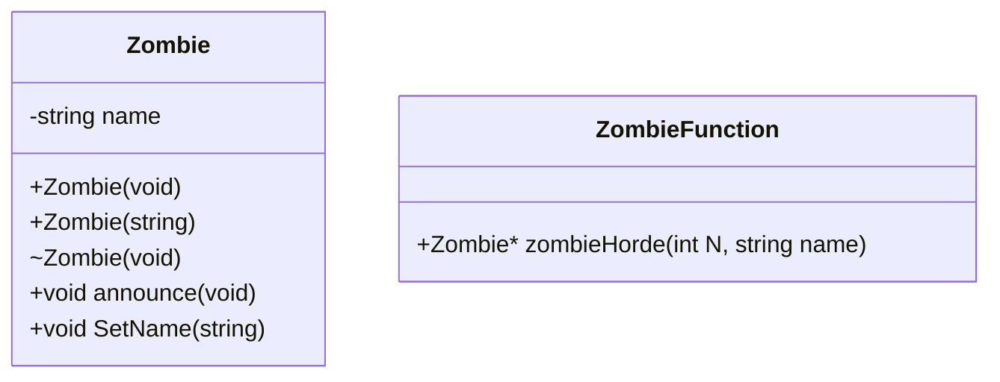

```mermaid
classDiagram

class ZOMBIE["Zombie"] {
    -string name

    +Zombie(void)
    +Zombie(string)
    ~Zombie(void)
    +void   announce(void)
    +void   SetName(string)
}

class ZOMBIE_FUNCTION["ZombieFunction"] {
    +Zombie*    zombieHorde(int N, string name)
}
```
