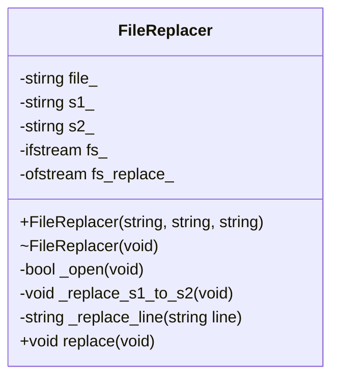

```mermaid
classDiagram

class FILEREPLACER["FileReplacer"] {
    -stirng         file_
    -stirng         s1_ 
    -stirng         s2_
    -ifstream       fs_
    -ofstream       fs_replace_

    +FileReplacer(string, string, string)
    ~FileReplacer(void)
    -bool           _open(void)
    -void           _replace_s1_to_s2(void)
    -string         _replace_line(string line)
    +void           replace(void)
}

```
