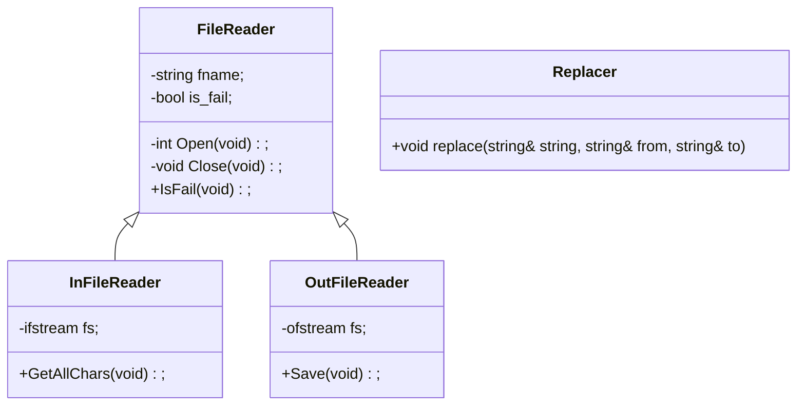

```mermaid
classDiagram

FILEREADER <|-- INFILEREADER
FILEREADER <|-- OUTFILEREADER

class REPLACER["Replacer"] {
    +void           replace(string& string, string& from, string& to)
}

class FILEREADER["FileReader"] {
    -string fname;
    -bool   is_fail;

    -int    Open(void);
    -void   Close(void);

    +IsFail(void);
}

class INFILEREADER["InFileReader"] {
    -ifstream   fs;
    +GetAllChars(void);
}

class OUTFILEREADER["OutFileReader"] {
    -ofstream   fs;
    +Save(void);
}

```
