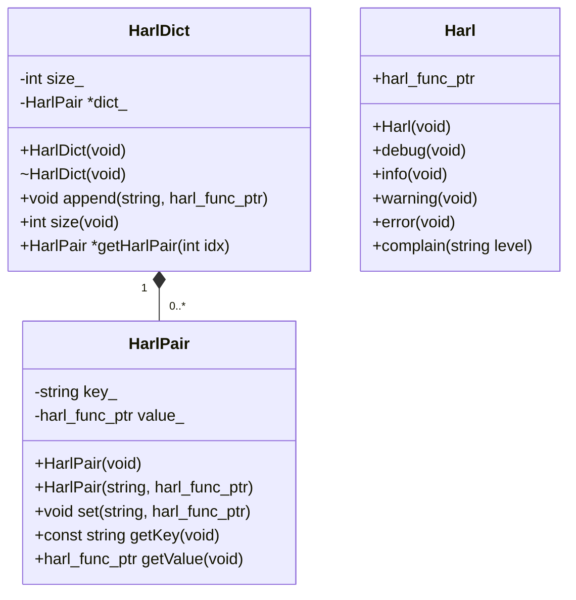

```mermaid
classDiagram

HARLDICT "1" *-- "0..*" HARLPAIR

class HARL["Harl"] {
    +harl_func_ptr

    +Harl(void)
    +debug(void)
    +info(void)
    +warning(void)
    +error(void)
    +complain(string level)
}

class HARLPAIR["HarlPair"] {
    -string         key_
    -harl_func_ptr  value_

    +HarlPair(void)
    +HarlPair(string, harl_func_ptr)
    +void    set(string, harl_func_ptr)
    +const string   getKey(void)
    +harl_func_ptr  getValue(void)
}

class HARLDICT["HarlDict"] {
    -int        size_
    -HarlPair   *dict_

    +HarlDict(void)
    ~HarlDict(void)
    +void        append(string, harl_func_ptr)
    +int         size(void)
    +HarlPair    *getHarlPair(int idx)
}
```
