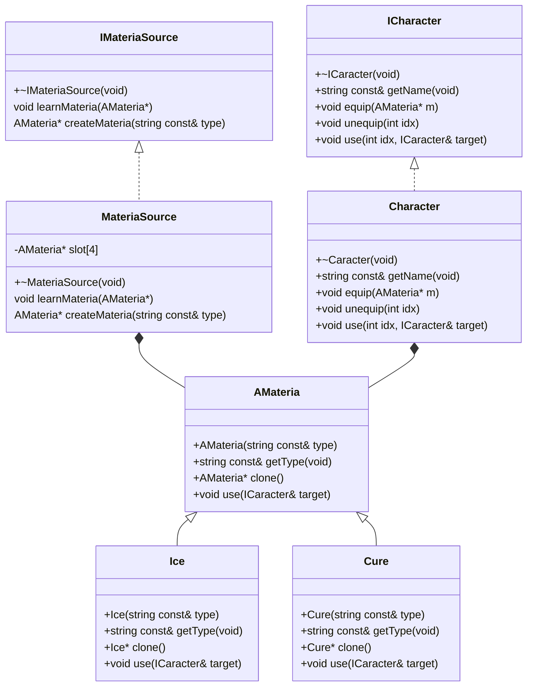

```mermaid
classDiagram

AMATERIA <|-- ICE
AMATERIA <|-- CURE

ICHARACTER <|.. CHARACTER
IMATERIASOURCE <|.. MATERIASOURCE

MATERIASOURCE *-- AMATERIA
CHARACTER *-- AMATERIA

class AMATERIA["AMateria"] {
    <!-- <<Abstract>> -->
    +AMateria(string const& type)
    +string const&  getType(void)
    +AMateria*      clone()
    +void            use(ICaracter& target)
}

class ICE["Ice"] {
    +Ice(string const& type)
    +string const&  getType(void)
    +Ice*           clone()
    +void            use(ICaracter& target)
}

class CURE["Cure"] {
    +Cure(string const& type)
    +string const&  getType(void)
    +Cure*          clone()
    +void            use(ICaracter& target)
}

class ICHARACTER["ICharacter"] {
    <!-- <<Interface>> -->
    +~ICaracter(void)
    +string const&  getName(void)
    +void           equip(AMateria* m)
    +void           unequip(int idx)
    +void           use(int idx, ICaracter& target)
}

class CHARACTER["Character"] {
    +~Caracter(void)
    +string const&  getName(void)
    +void           equip(AMateria* m)
    +void           unequip(int idx)
    +void           use(int idx, ICaracter& target)
}

class IMATERIASOURCE["IMateriaSource"] {
    <!-- <<Interface>> -->
    +~IMateriaSource(void)
    void        learnMateria(AMateria*)
    AMateria*   createMateria(string const& type)
}

class MATERIASOURCE["MateriaSource"] {
    -AMateria*  slot[4]

    +~MateriaSource(void)
    void        learnMateria(AMateria*)
    AMateria*   createMateria(string const& type)
}

```
